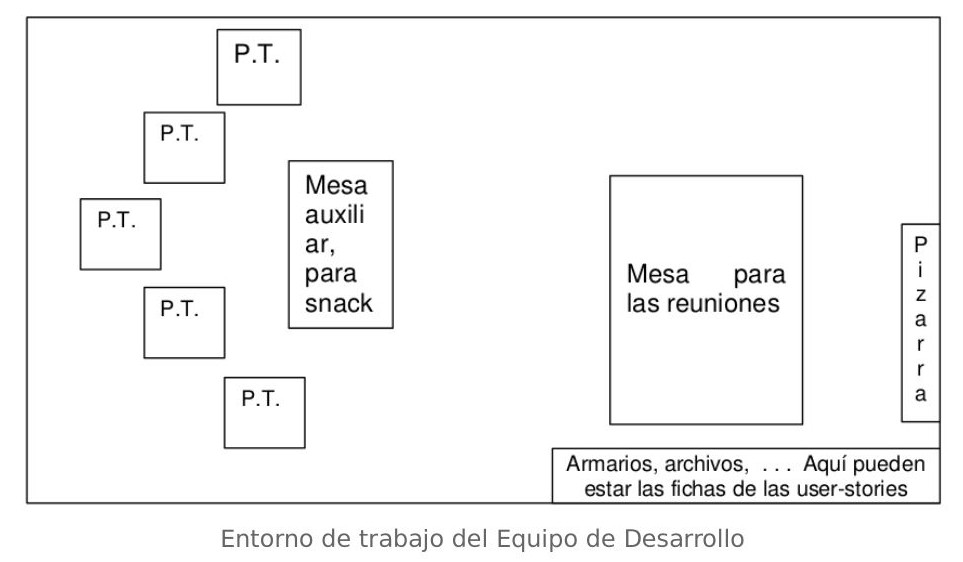

# Entorno de trabajo

:::warning Orientado a la Comunicación
No se verá sorprendido por encontrarse un apartado dedicado a _"La Comunicación dentro del Equipo"_.
:::

>En este apartado vamos a describir lo que consideramos como un entorno de trabajo orientado a la buena comunicación entre los integrantes del equipo. Asumimos unas 4 a 12 personas. Todo lo que se exponga aquí, es una referencia que puede ser llevada a otras necesidades un tanto más concretas.

Este esquema para trabajar nos aporta varias cosas. La primera, los grupos de trabajo (parejas), se sientan cerca unos de otros, intentando formar un semicírculo abierto, por dos razones, la primera, el poder verse unos a otros. Esto permite un gran contacto visual, y, en muchas ocasiones, logra un ambiente más distendido, impidiendo el que cada grupo se cierre a su trabajo.
 
La segunda ventaja que se logra es que todos tienen a vista la pizarra dónde se anotan las tareas a realizar, en la reunión de apertura.

Evidentemente, la disposición de los puestos de trabajo puede ser distinta, pero una distribución similar a esta nos permitirá ganar bastante, sobre todo contando con grupos de 4 a 12 personas, porque, si no, es mucho más difícil el conseguir esto en una habitación no muy grande. Y si la habitación es muy grande, se pierde el contacto con la pizarra y muy fácilmente el contacto visual entre componentes.

>El que la pizarra se encuentre en la zona de trabajo presenta las ventajas que ya hemos visto, pero lo no tan claro es que la mesa de reuniones esté en el mismo sitio. Otra posibilidad sería tener una pizarra móvil y tener las reuniones en otra sala. Nuestro punto de vista es que la primera opción es mejor, ya que perdemos menos tiempo al no tener que andar de una habitación a otra (lo cuál no es una tontería si contáramos las horas que se pueden llegar a perder por movimientos entre habitaciones, con sus consecuentes pérdidas de tiempo al encontrarse a alguien en el pasillo, etc.) y además conseguimos que cuando el Dueño del Producto venga a exponer sus Historias de Usuario ya sea en una reunión de apertura o para tratarlas a nivel más particular con algunos desarrolladores, él se integre en el ritmo de trabajo del equipo y el equipo tenga una visión más global del proyecto.

Otro punto importante es tener los _“snacks”_ en un lugar cercano a los puestos de trabajo. Esto sirve para que cuando los desarrolladores decidan
tomarse un respiro por un momento, beber agua, etc., no se rompa el ritmo de trabajo al estar en contacto con el resto, perdiendo una cantidad mínima de tiempo, y, además, logramos que no se cohíban de tomarse un momento de alivio al tener el derecho reconocido las facilidades dispuestas para ello.

El entorno de trabajo debe considerar las siguientes características:
 
- **Audibilidad**: cualquier miembro del equipo puede hablar con cualquier otro sin tener que levantarse de su sitio.
- **Visibilidad**: todo el mundo puede ver a los demás. Todo el mundo puede ver el tablón de tareas. No necesariamente tan de cerca como para poder
leerlo, pero si por lo menos verlo.
- **Aislamiento**: si todo el equipo necesitase levantarse y agruparse para una animada y espontánea discusión sobre el diseño, nadie fuera del equipo está tan cerca como para ser molestado. Y viceversa. “Aislamiento” no significa que el equipo tenga que estar completamente aislado. En un entorno cubicular, puede ser suficiente que el equipo tenga su propio cubículo y paredes suficientemente gruesas como para filtrar la mayoría
del ruido de los elementos fuera del equipo.

>Usualmente hay limitaciones físicas ¿Y que pasa si tienes un equipo distribuido? Bueno, entonces mala suerte. Usa tantas técnicas como sea posible para minimizar el daño – videoconferencia, webcams, herramientas de compartición de escritorio, etc.

